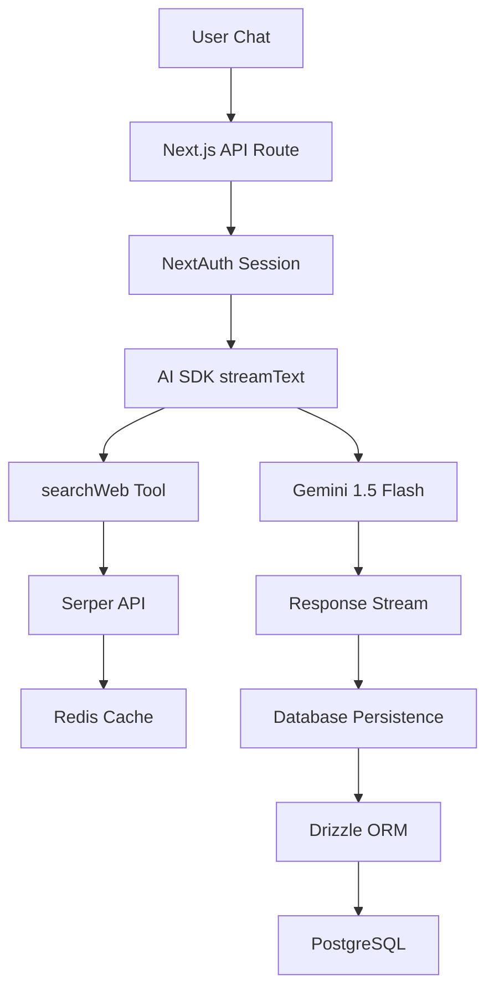

# LEARNINGS.md

_Living document tracking our AI application development journey. Updated daily with insights, patterns, and discoveries._

---

## Current Project State

**AI-powered search chat application** combining Google Gemini models with real-time web search via Serper API. Stream-first architecture using Next.js 15 + AI SDK with tool-calling patterns for web search, Redis-cached results, and PostgreSQL persistence.

**Key Capabilities**:

- ✅ Discord OAuth authentication
- ✅ Session-based chat persistence
- ✅ Real-time search tool integration
- ✅ Redis caching (6h TTL)
- ✅ Message streaming with AI SDK
- ✅ **Langfuse observability & analytics** (dual telemetry approach)
- ✅ **Environment-aware telemetry** (dev/prod separation)
- ✅ **Automatic AI interaction tracking** (zero-friction future observability)

**Last Updated**: 2025-07-17

---

## Daily Learning Log

### 2025-07-17 - Initial Analysis & Documentation

**Repository Census Completed**

- Analyzed 3-day development sprint (July 14-16, 2025)
- Catalogued 21 runtime + 26 dev dependencies
- Identified core architecture patterns and anti-patterns

**Key Discovery**: Message storage as JSON blob creates dangerous AI SDK dependency

- **Risk**: Database schema tied to AI SDK message format expectations
- **Impact**: Future AI SDK updates could break persistence layer
- **Source**: Author's note in `observations.md:1`

**Architecture Insights**:

- Tool-calling pattern in `route.ts:157-193` shows clean separation
- Redis caching wrapper `redis.ts:9-25` demonstrates reusable pattern
- Environment validation via t3-env prevents runtime failures

### 2025-07-17 - Langfuse Observability Integration

**What We Built**:

- ✅ Comprehensive Langfuse telemetry integration (2-phase approach)
- ✅ OpenTelemetry instrumentation with environment tracking
- ✅ Direct Langfuse client for enhanced session/user analytics
- ✅ Automatic telemetry for all AI SDK interactions

**Key Discoveries**:

- **Dual Telemetry Approach**: Combined OpenTelemetry auto-instrumentation with direct Langfuse client for maximum observability

  - **Why it matters**: Auto-tracking via OpenTelemetry + custom analytics via direct client = comprehensive coverage without future code changes
  - **Source**: `instrumentation.ts:5-11` + `route.ts:116-120`

- **Session-Centric Analytics**: Using `chatId` as `sessionId` creates natural conversation grouping

  - **Why it matters**: Enables conversation flow analysis and user engagement patterns
  - **Source**: `route.ts:116-120`

- **Zero-Friction Future Tracking**: All `streamText` calls automatically tracked via `experimental_telemetry`
  - **Why it matters**: No code changes needed for future AI interactions to be observable
  - **Source**: `route.ts:228-234`

**Patterns Identified**:

- **Environment-Aware Telemetry**: `NODE_ENV` separation for dev/prod data isolation
- **Trace Correlation**: `langfuseTraceId` metadata links AI SDK telemetry with custom traces
- **Async Flush Pattern**: `flushAsync()` ensures data delivery before response completion

**Code References**:

- `instrumentation.ts:5-11` - OpenTelemetry registration with LangfuseExporter
- `route.ts:116-120` - Trace creation with session and user context
- `route.ts:228-234` - Enhanced telemetry configuration with metadata
- `route.ts:271` - Async flush to ensure data delivery

**New Analytics Capabilities**:

- Session flow tracking and conversation analytics
- User behavior patterns and engagement metrics
- Tool usage effectiveness (searchWeb performance)
- Response times, token usage, and cost monitoring
- Environment-separated dev/prod data

---

## Architecture Documentation

## Core Architecture Overview



**Tech Stack:**

- **Frontend**: Next.js 15.2.4, React 18.3.1, TypeScript, Tailwind CSS
- **AI/ML**: Vercel AI SDK, Google Gemini 1.5 Flash/Pro
- **Database**: PostgreSQL + Drizzle ORM
- **Caching**: Redis (ioredis 5.5.0)
- **Auth**: NextAuth 5.0.0-beta.25 + Discord OAuth
- **Search**: Serper API (Google Search)

## Data Flow

1. **Chat Initiation**: User sends message → NextAuth validates session
2. **Message Processing**: AI SDK transforms to conversation format
3. **Tool Execution**: searchWeb calls Serper API → Redis cache check (6h TTL)
4. **AI Response**: Gemini processes search results → streams response
5. **Persistence**: appendResponseMessages saves to Postgres via Drizzle

**Message Format Challenge**: Complex transformation between AI SDK format and database storage in `route.ts:10-53`.

## Prompt Design

**System Prompt Strategy** (`route.ts:213-226`):

```typescript
system: `You are a helpful AI assistant with access to real-time web search capabilities.

MANDATORY TOOL USAGE:
- You HAVE a searchWeb tool available RIGHT NOW
- For the user's questions, you MUST call searchWeb("users_question", 10)
- Do NOT say you need the function provided - IT IS ALREADY AVAILABLE
```

**Why it matters**: Explicit tool usage instructions prevent AI from claiming lack of capabilities.

## Patterns & Anti-patterns

### ✅ Good Patterns

1. **Generic Redis Caching** (`redis.ts:9-25`):

```typescript
export const cacheWithRedis = <TFunc extends (...args: any[]) => Promise<any>>(
  keyPrefix: string,
  fn: TFunc,
): TFunc => {
  return (async (...args: Parameters<TFunc>) => {
    const key = `${keyPrefix}${CACHE_KEY_SEPARATOR}${JSON.stringify(args)}`;
    const cachedResult = await redis.get(key);
    if (cachedResult) return JSON.parse(cachedResult);

    const result = await fn(...args);
    await redis.set(key, JSON.stringify(result), "EX", CACHE_EXPIRY_SECONDS);
    return result;
  }) as TFunc;
};
```

2. **Dual Telemetry Architecture** (`instrumentation.ts:5-11` + `route.ts:116-120`):

```typescript
// Auto-instrumentation via OpenTelemetry
export function register() {
  registerOTel({
    serviceName: "langfuse-vercel-ai-nextjs-example",
    traceExporter: new LangfuseExporter({ environment: env.NODE_ENV }),
  });
}

// Direct client for enhanced analytics
const trace = langfuse.trace({
  sessionId: chatId,
  name: "chat",
  userId: session.user.id,
});
```

3. **Environment Validation** (`env.js:4-56`): t3-env + Zod schema validation prevents runtime errors.

4. **Tool Definition Structure** (`route.ts:157-193`): Clean separation of tool logic with proper TypeScript typing.

### ⚠️ Anti-patterns

1. **Message Storage Risk** (Author note in `observations.md:1`):

   > "storing messages as a JSON blob. I find this pretty dangerous, Because the shape of your database then has a dependency on what the AI SDK expects."

2. **Console Logging in Production**: Extensive `console.log` statements throughout codebase need structured logging.

## Security

**✅ Implemented**:

- Environment variable validation
- API key management (`SERPER_API_KEY`, `GOOGLE_GENERATIVE_AI_API_KEY`, `LANGFUSE_*`)
- Session-based authentication
- CSRF protection via NextAuth
- Environment-separated telemetry (dev/prod isolation)

**🚨 Gaps**:

- No rate limiting for anonymous users
- No input validation for search queries
- No secret rotation strategy

## Libraries & Tools

| Library               | Purpose                       | Version       | Key Files                            |
| --------------------- | ----------------------------- | ------------- | ------------------------------------ |
| @ai-sdk/google        | Google AI integration         | ^1.2.22       | `models.ts`, `route.ts`              |
| drizzle-orm           | Database ORM                  | ^0.33.0       | `schema.ts`, `queries.ts`            |
| next-auth             | Authentication                | 5.0.0-beta.25 | `config.ts`, `route.ts`              |
| ioredis               | Redis client                  | ^5.5.0        | `redis.ts`, `serper.ts`              |
| **langfuse**          | **LLM observability**         | **^3.38.4**   | **`route.ts`, `instrumentation.ts`** |
| **langfuse-vercel**   | **Vercel AI SDK integration** | **^3.38.4**   | **`instrumentation.ts`**             |
| **@vercel/otel**      | **OpenTelemetry for Vercel**  | **^1.13.0**   | **`instrumentation.ts`**             |
| **@opentelemetry/\*** | **Telemetry infrastructure**  | **^0.203.0**  | **`package.json`**                   |

---

## Daily Entry Template

```markdown
### YYYY-MM-DD - [Session Focus/Theme]

**What We Built/Analyzed**:

- [ ] Feature/component/analysis completed

**Key Discoveries**:

- **Discovery**: [Brief description]
  - **Why it matters**: [Impact/implications]
  - **Source**: [File path:line number or commit hash]

**Patterns Identified**:

- [Pattern name]: [Description and location]
- [Anti-pattern]: [What to avoid and why]

**Action Items**:

- [ ] [Specific task with clear outcome]
- [ ] [Another actionable item]

**Code References**:

- `file_path:line_range` - [What this code demonstrates]
```

---

## Historical Context

**Git Timeline**:

- `45147be` (2025-07-14): Initial commit
- `8463672` (2025-07-14): Day one foundation
- `e241925` (2025-07-15): Search functionality restored
- `da34d8a` (2025-07-15): Chat session tracking added
- `dec6655` (2025-07-15): Conversation persistence implemented
- `958f268` (2025-07-16): Chat list view and scroll behavior

**Evolution Summary**: 3-day rapid prototyping sprint focusing on core chat functionality with tool integration.
