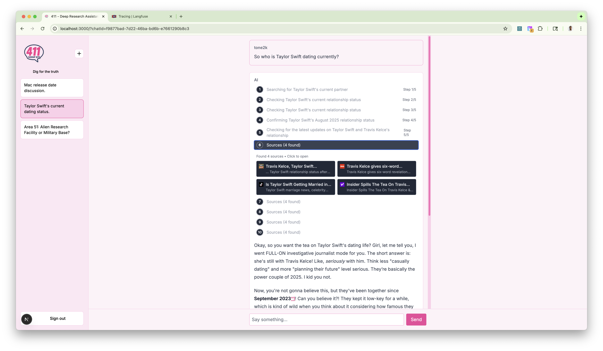
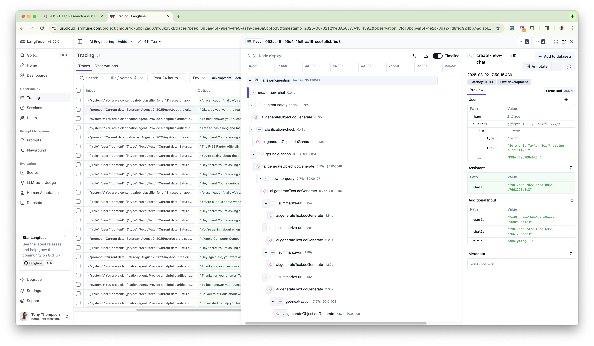
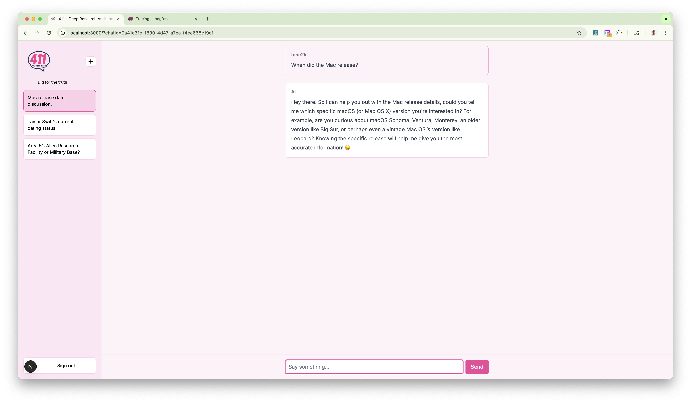
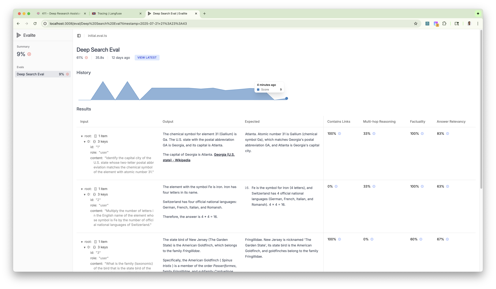

# 411 - Your Friend Who Always Has The Tea ☕

You know that friend who somehow always knows everything about everything? The one you text when you need the REAL story on something? That's 411 - except it's powered by AI and actually does the deep digging to get you the goods. This project showcases advanced AI engineering through the lens of building the ultimate information-gathering bestie.

## What's 411?

411 is like having that one friend who's basically an investigative journalist but actually fun to talk to. It doesn't just Google stuff and call it a day - it goes DEEP, checking multiple sources, following leads, and coming back with the full story. Think of it as your personal information detective who explains everything like you're catching up over coffee.


*411 in action - showing real-time research progress as it digs up information about Taylor Swift's dating life*

### Why 411 Slaps Different

- **Actually Does The Homework**: Multi-step research that digs deeper than surface-level answers
- **Knows How To Read The Room**: Smart content analysis that understands context and nuance
- **Explains It Like A Human**: No robot speak - just clear explanations with actual personality
- **Keeps It Safe**: Built-in guardrails so it stays helpful, not harmful
- **Shows Its Work**: Full source citations so you know it's not making stuff up
- **Gets Better Over Time**: Comprehensive evaluation system that ensures quality
- **Real-Time Updates**: Watch it work in real-time as it gathers the tea

## Tech Stack

### AI & ML Infrastructure

- **Google AI SDK (Gemini)** - Advanced LLM integration with structured generation
- **Zod** - Type-safe schema validation for AI outputs
- **OpenTelemetry + Langfuse** - Production AI observability and tracing


*Behind the scenes: Langfuse tracing shows exactly how 411 processes queries through its multi-agent system*
- **Evalite** - AI evaluation and testing framework for comprehensive LLM testing

### Backend & Data

- **Next.js 15** - App Router with Server Components
- **PostgreSQL + Drizzle ORM** - Type-safe database operations
- **Redis** - Intelligent caching and session management
- **NextAuth v5** - Modern authentication with OAuth

### External Services

- **Serper API** - High-quality web search
- **Custom Web Crawler** - Robots.txt compliant content extraction

## Quick Start

### Prerequisites

- Node.js 20+ and pnpm 9+
- Docker Desktop (for PostgreSQL and Redis)
- API keys: Google AI, Serper, Discord OAuth

### Installation

1. **Clone and install dependencies**

   ```bash
   git clone <repository-url>
   cd 01-day-1-app
   pnpm install
   ```

2. **Configure environment variables**

   Required environment variables:

   - `DATABASE_URL` - PostgreSQL connection string
   - `REDIS_URL` - Redis connection string
   - `GOOGLE_GENERATIVE_AI_API_KEY` - Google AI API key
   - `SERPER_API_KEY` - Serper search API key
   - `AUTH_DISCORD_ID` & `AUTH_DISCORD_SECRET` - Discord OAuth
   - `AUTH_SECRET` - NextAuth secret
   - `LANGFUSE_*` - Langfuse observability (optional)

3. **Start infrastructure services**

   ```bash
   ./start-database.sh
   ./start-redis.sh
   ```

4. **Initialize database**

   ```bash
   pnpm db:push
   ```

5. **Start development server**
   ```bash
   pnpm dev
   ```

## Architecture

### AI Agent Workflow

411 runs on a sophisticated multi-agent system that's basically like having a whole squad of researchers working together. Here's how your digital bestie gets you the answers:


_The 411 Loop - Your AI bestie's process for digging up all the tea and serving it piping hot with receipts._

#### Phase 1: "Wait, Let Me Make Sure I Got That Right"

**Content Safety Guardrails** (`src/guardrails.ts`)

- Multi-layered safety classification using specialized models
- Conversation context analysis for pattern detection
- Comprehensive safety guidelines covering illegal activities, harmful content, and privacy violations
- Structured output validation with Zod schemas

```typescript
// Safety classification with conversation context
const result = await generateObject({
  model: guardrailModel,
  schema: z.object({
    classification: z.enum(["allow", "refuse"]),
    reason: z.string().optional(),
  }),
  system: "Analyze conversation context for safety violations...",
});
```

**Clarification Detection** (`src/clarification.ts`)

- AI-powered ambiguity detection for vague or unclear queries
- Context-aware analysis considering conversation history
- Proactive clarification requests to improve research quality


*411 asking for clarification when a question is too vague - because even your bestie needs context sometimes*

#### Phase 2: "Okay, Time To Do Some Digging"

**Dynamic Action Planning** (`src/deep-search.ts`)

- Sophisticated decision engine with structured generation
- Evaluation criteria: completeness, accuracy, specificity, coverage
- Intelligent stopping conditions and max iteration handling (5 steps)

```typescript
const actionSchema = z.object({
  title: z.string().describe("Concise action title for UI display"),
  reasoning: z.string().describe("Decision rationale"),
  type: z.enum(["continue", "answer"]),
  query: z.string().optional(),
  feedback: z.string().optional(),
});
```

**SystemContext State Management** (`src/system-context.ts`)

- Persistent conversation state across research iterations
- Search history with URL summaries and metadata
- Token usage tracking and cost monitoring
- User location context for geo-aware responses

#### Phase 3: "Let Me Check My Sources"

**Query Optimization** (`src/query-rewriter.ts`)

- AI-powered query rewriting based on evaluator feedback
- Date-aware search terms for recent information
- Feedback-driven iteration to fill information gaps

**Parallel Processing Pipeline**

- Concurrent web search via Serper API (configurable result count)
- Bulk content scraping with robots.txt compliance
- Parallel AI summarization of scraped content
- Redis caching with 6-hour TTL for expensive operations

```typescript
// Parallel summarization with error handling
const summarizationInputs: SummarizeURLInput[] = searchResults.map(
  (result) => ({
    conversationHistory,
    scrapedContent: scrapeContentMap.get(result.link),
    searchMetadata: { title, url, snippet, date },
    query,
  }),
);

const summaryResults = await summarizeURLs(summarizationInputs);
```

#### Phase 4: "Do I Have The Full Story Yet?"

**Evaluation Criteria Engine**

- **Completeness**: All requested information available?
- **Accuracy**: Information from reliable, up-to-date sources?
- **Specificity**: Detailed information vs. general knowledge?
- **Coverage**: Multiple aspects of the question explored?

**Smart Stopping Logic**

- Continue research when information gaps exist
- Answer when sufficient context is available
- Force answer after 5 iterations to prevent infinite loops
- Graceful degradation with partial information acknowledgment

#### Phase 5: "Girl, Let Me Tell You What I Found Out"

**Context-Aware Answer Synthesis** (`src/answer-question.ts`)

- Comprehensive system prompts with date and location awareness
- Structured response format with footnote citations
- Conversational tone with bold emphasis on key facts
- Progressive response building with smooth streaming

**Real-Time Progress Indicators**

- Step-by-step progress updates to frontend
- Live token usage tracking
- Source display during research process
- Streaming response with word-level chunking

### Technical Implementation Highlights

**Advanced Prompt Engineering**

```typescript
const systemPrompt = `Current date: ${currentDate}
${context.getUserLocationContext()}

EVALUATION CRITERIA:
- Completeness: Do we have ALL information requested?
- Accuracy: Is information from reliable sources?
- Specificity: Do we have specific details?
- Coverage: Have we explored different aspects?

DECISION GUIDELINES:
- Continue if information gaps exist
- Answer when sufficient context available
- Consider search pattern failures
`;
```

**Production-Ready Error Handling**

- Graceful degradation for failed searches
- Partial result handling for scraping failures
- Comprehensive logging and telemetry
- Retry logic with exponential backoff

**Performance Optimizations**

- Redis caching for expensive operations
- Parallel processing of AI operations
- Efficient token usage tracking
- Memory-efficient context management

This architecture demonstrates enterprise-grade AI agent design with sophisticated decision-making, robust error handling, and production-ready performance optimizations.

## Evaluation Framework

### Making Sure 411 Stays On Point

411 uses [Evalite](https://evalite.dev) to make sure it's always bringing you quality intel, not just random nonsense. Think of it as the friend group that fact-checks before spreading rumors - keeping your AI bestie honest and accurate.


*The Evalite dashboard showing 411's evaluation metrics - ensuring every answer meets quality standards*

#### Key Features

**Multi-Dimensional Scoring**
- **Factuality**: LLM-as-a-judge comparison against expert answers using advanced prompt engineering
- **Link Inclusion**: Validates proper source attribution with markdown link detection
- **Multi-hop Reasoning**: Measures complex reasoning capabilities and step-by-step analysis
- **Answer Relevancy**: Semantic similarity assessment between queries and responses

**Production-Ready Evaluation Pipeline**
```bash
pnpm evals          # Run evaluation suite in watch mode
```

The evaluation framework includes:

- **Development Dataset** (`evals/dev.ts`) - Core test cases for feature development
- **CI Dataset** (`evals/ci.ts`) - Automated testing for continuous integration
- **Regression Dataset** (`evals/regression.ts`) - Historical test cases to prevent regressions

#### Evaluation Metrics

**Factuality Scorer** (`evals/initial.eval.ts`)
```typescript
export const checkFactuality = async (opts: {
  question: string;
  groundTruth: string;
  submission: string;
}) => {
  const { object } = await generateObject({
    model: factualityModel,
    schema: z.object({
      answer: z.enum(["A", "B", "C", "D", "E"]),
      rationale: z.string(),
    }),
  });
  
  // Scoring: A=0.4, B=0.6, C=1.0, D=0.0, E=1.0
  return { score: scores[object.answer], metadata: { rationale } };
};
```

**Custom Scoring Framework**
- Automated detection of reasoning patterns and logical connections
- Source attribution validation with regex pattern matching
- Semantic similarity assessment for answer relevancy
- Configurable scoring thresholds for different quality standards

#### Dataset Configuration

The evaluation system supports environment-based dataset selection:
- `EVAL_DATASET=dev` - Development testing (default)
- `EVAL_DATASET=ci` - CI pipeline with extended test coverage
- `EVAL_DATASET=regression` - Full regression suite with historical cases

#### Integration with Development Workflow

**Live Evaluation During Development**
```bash
pnpm evals          # Launches evaluation dashboard on localhost:3006
```

**Automated Quality Gates**
- Continuous evaluation during feature development
- Regression prevention with historical test preservation
- Performance benchmarking across model updates
- Quality metrics tracking for production deployment decisions

This testing framework is what makes sure 411 stays that reliable friend who actually knows what they're talking about - not the one who just makes stuff up for attention.

### Key Components

- **Agent Loop** (`src/run-agent-loop.ts`) - Multi-step research orchestration with state management
- **Deep Search** (`src/deep-search.ts`) - AI-powered decision making for continue vs. answer
- **System Context** (`src/system-context.ts`) - Conversation state and search history management
- **Query Rewriter** (`src/query-rewriter.ts`) - Intelligent query optimization for better results
- **Guardrails** (`src/guardrails.ts`) - Multi-layered content safety and moderation
- **Clarification** (`src/clarification.ts`) - AI-powered ambiguity detection and clarification

### Data Flow

1. **Input Processing**: Query validation, safety checks, and clarification detection
2. **Research Planning**: AI determines optimal search strategy and query reformulation
3. **Iterative Search**: Multiple search rounds with intelligent stopping criteria
4. **Content Processing**: Parallel web scraping, content extraction, and AI summarization
5. **Answer Generation**: Synthesis of information with comprehensive source attribution
6. **Streaming Response**: Real-time delivery with progress indicators
