# DeepSearch - AI Research Agent

An AI research assistant that performs multi-step web searches and synthesizes comprehensive answers to complex questions. This project demonstrates advanced Applied AI Engineering patterns including multi-agent orchestration, LLM evaluation frameworks, and enterprise-grade AI system design.

## Overview

DeepSearch goes beyond simple search by implementing sophisticated AI agent workflows. It understands questions, performs iterative research, analyzes content from multiple sources, and delivers well-researched, comprehensive answers with proper citations.

### Key Features

- **Multi-Agent Research**: Implements sophisticated agent loops with state management and decision trees
- **Intelligent Content Analysis**: AI-powered web scraping and content summarization
- **Advanced LLM Integration**: Structured generation, tool calling, and streaming responses
- **Production-Ready Guardrails**: Content moderation, rate limiting, and safety checks
- **Comprehensive Evaluation**: LLM-as-a-judge evaluation framework with custom metrics
- **Enterprise Observability**: OpenTelemetry + Langfuse integration for AI tracing
- **Real-Time Streaming**: Live progress updates during research process

## Tech Stack

### AI & ML Infrastructure

- **Google AI SDK (Gemini)** - Advanced LLM integration with structured generation
- **Zod** - Type-safe schema validation for AI outputs
- **OpenTelemetry + Langfuse** - Production AI observability and tracing
- **Evalite** - AI evaluation and testing framework

### Backend & Data

- **Next.js 15** - App Router with Server Components
- **PostgreSQL + Drizzle ORM** - Type-safe database operations
- **Redis** - Intelligent caching and session management
- **NextAuth v5** - Modern authentication with OAuth

### External Services

- **Serper API** - High-quality web search
- **Custom Web Crawler** - Robots.txt compliant content extraction

## Quick Start

### Prerequisites

- Node.js 20+ and pnpm 9+
- Docker Desktop (for PostgreSQL and Redis)
- API keys: Google AI, Serper, Discord OAuth

### Installation

1. **Clone and install dependencies**

   ```bash
   git clone <repository-url>
   cd deep-research
   pnpm install
   ```

2. **Configure environment variables**

   Required environment variables:

   - `DATABASE_URL` - PostgreSQL connection string
   - `REDIS_URL` - Redis connection string
   - `GOOGLE_GENERATIVE_AI_API_KEY` - Google AI API key
   - `SERPER_API_KEY` - Serper search API key
   - `AUTH_DISCORD_ID` & `AUTH_DISCORD_SECRET` - Discord OAuth
   - `AUTH_SECRET` - NextAuth secret
   - `LANGFUSE_*` - Langfuse observability (optional)

3. **Start infrastructure services**

   ```bash
   ./start-database.sh
   ./start-redis.sh
   ```

4. **Initialize database**

   ```bash
   pnpm db:push
   ```

5. **Start development server**
   ```bash
   pnpm dev
   ```

## Architecture

### AI Agent Workflow

The system implements a sophisticated multi-agent architecture with intelligent decision-making, parallel processing, and comprehensive state management. Here's the detailed workflow:



_The 411 Agent Loop - A sophisticated multi-step research workflow that iteratively refines and expands search queries to deliver comprehensive answers._

#### Phase 1: Input Processing & Safety Pipeline

**Content Safety Guardrails** (`src/guardrails.ts`)

- Multi-layered safety classification using specialized models
- Conversation context analysis for pattern detection
- Comprehensive safety guidelines covering illegal activities, harmful content, and privacy violations
- Structured output validation with Zod schemas

```typescript
// Safety classification with conversation context
const result = await generateObject({
  model: guardrailModel,
  schema: z.object({
    classification: z.enum(["allow", "refuse"]),
    reason: z.string().optional(),
  }),
  system: "Analyze conversation context for safety violations...",
});
```

**Clarification Detection** (`src/clarification.ts`)

- AI-powered ambiguity detection for vague or unclear queries
- Context-aware analysis considering conversation history
- Proactive clarification requests to improve research quality

#### Phase 2: Agent Loop Architecture

**Dynamic Action Planning** (`src/deep-search.ts`)

- Sophisticated decision engine with structured generation
- Evaluation criteria: completeness, accuracy, specificity, coverage
- Intelligent stopping conditions and max iteration handling (5 steps)

```typescript
const actionSchema = z.object({
  title: z.string().describe("Concise action title for UI display"),
  reasoning: z.string().describe("Decision rationale"),
  type: z.enum(["continue", "answer"]),
  query: z.string().optional(),
  feedback: z.string().optional(),
});
```

**SystemContext State Management** (`src/system-context.ts`)

- Persistent conversation state across research iterations
- Search history with URL summaries and metadata
- Token usage tracking and cost monitoring
- User location context for geo-aware responses

#### Phase 3: Intelligent Search & Processing

**Query Optimization** (`src/query-rewriter.ts`)

- AI-powered query rewriting based on evaluator feedback
- Date-aware search terms for recent information
- Feedback-driven iteration to fill information gaps

**Parallel Processing Pipeline**

- Concurrent web search via Serper API (configurable result count)
- Bulk content scraping with robots.txt compliance
- Parallel AI summarization of scraped content
- Redis caching with 6-hour TTL for expensive operations

```typescript
// Parallel summarization with error handling
const summarizationInputs: SummarizeURLInput[] = searchResults.map(
  (result) => ({
    conversationHistory,
    scrapedContent: scrapeContentMap.get(result.link),
    searchMetadata: { title, url, snippet, date },
    query,
  }),
);

const summaryResults = await summarizeURLs(summarizationInputs);
```

#### Phase 4: Decision Intelligence

**Evaluation Criteria Engine**

- **Completeness**: All requested information available?
- **Accuracy**: Information from reliable, up-to-date sources?
- **Specificity**: Detailed information vs. general knowledge?
- **Coverage**: Multiple aspects of the question explored?

**Smart Stopping Logic**

- Continue research when information gaps exist
- Answer when sufficient context is available
- Force answer after 5 iterations to prevent infinite loops
- Graceful degradation with partial information acknowledgment

#### Phase 5: Response Generation & Streaming

**Context-Aware Answer Synthesis** (`src/answer-question.ts`)

- Comprehensive system prompts with date and location awareness
- Structured response format with footnote citations
- Conversational tone with bold emphasis on key facts
- Progressive response building with smooth streaming

**Real-Time Progress Indicators**

- Step-by-step progress updates to frontend
- Live token usage tracking
- Source display during research process
- Streaming response with word-level chunking

### Technical Implementation Highlights

**Advanced Prompt Engineering**

```typescript
const systemPrompt = `Current date: ${currentDate}
${context.getUserLocationContext()}

EVALUATION CRITERIA:
- Completeness: Do we have ALL information requested?
- Accuracy: Is information from reliable sources?
- Specificity: Do we have specific details?
- Coverage: Have we explored different aspects?

DECISION GUIDELINES:
- Continue if information gaps exist
- Answer when sufficient context available
- Consider search pattern failures
`;
```

**Production-Ready Error Handling**

- Graceful degradation for failed searches
- Partial result handling for scraping failures
- Comprehensive logging and telemetry
- Retry logic with exponential backoff

**Performance Optimizations**

- Redis caching for expensive operations
- Parallel processing of AI operations
- Efficient token usage tracking
- Memory-efficient context management

This architecture demonstrates enterprise-grade AI agent design with sophisticated decision-making, robust error handling, and production-ready performance optimizations.

### Key Components

- **Agent Loop** (`src/run-agent-loop.ts`) - Multi-step research orchestration with state management
- **Deep Search** (`src/deep-search.ts`) - AI-powered decision making for continue vs. answer
- **System Context** (`src/system-context.ts`) - Conversation state and search history management
- **Query Rewriter** (`src/query-rewriter.ts`) - Intelligent query optimization for better results
- **Guardrails** (`src/guardrails.ts`) - Multi-layered content safety and moderation
- **Clarification** (`src/clarification.ts`) - AI-powered ambiguity detection and clarification

### Data Flow

1. **Input Processing**: Query validation, safety checks, and clarification detection
2. **Research Planning**: AI determines optimal search strategy and query reformulation
3. **Iterative Search**: Multiple search rounds with intelligent stopping criteria
4. **Content Processing**: Parallel web scraping, content extraction, and AI summarization
5. **Answer Generation**: Synthesis of information with comprehensive source attribution
6. **Streaming Response**: Real-time delivery with progress indicators
